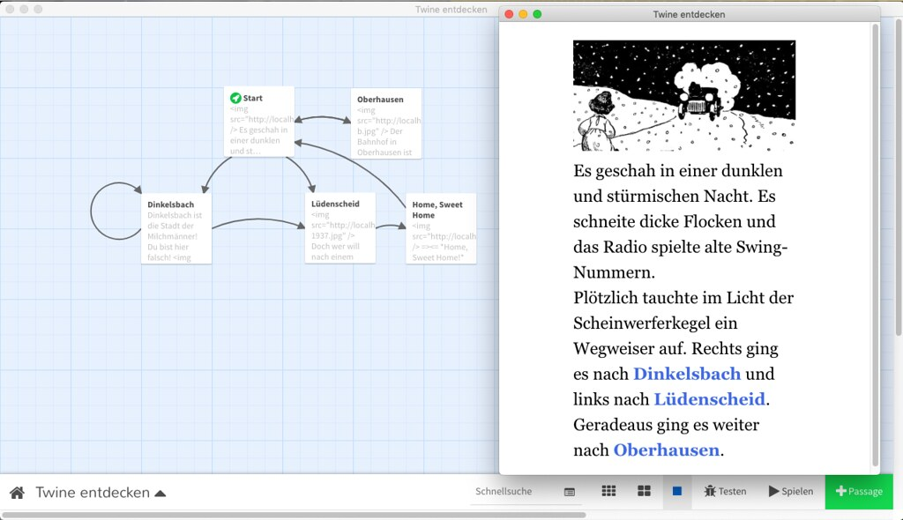
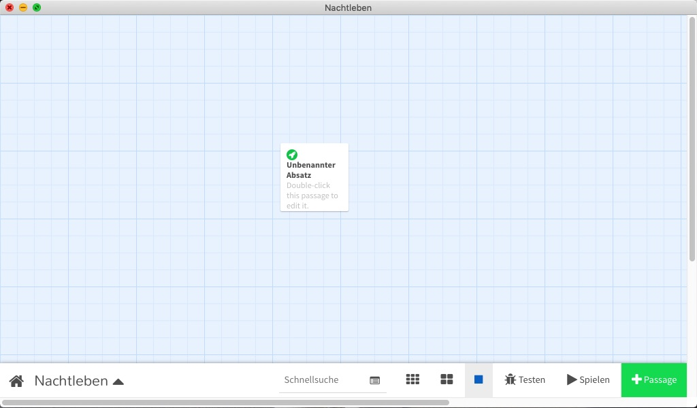
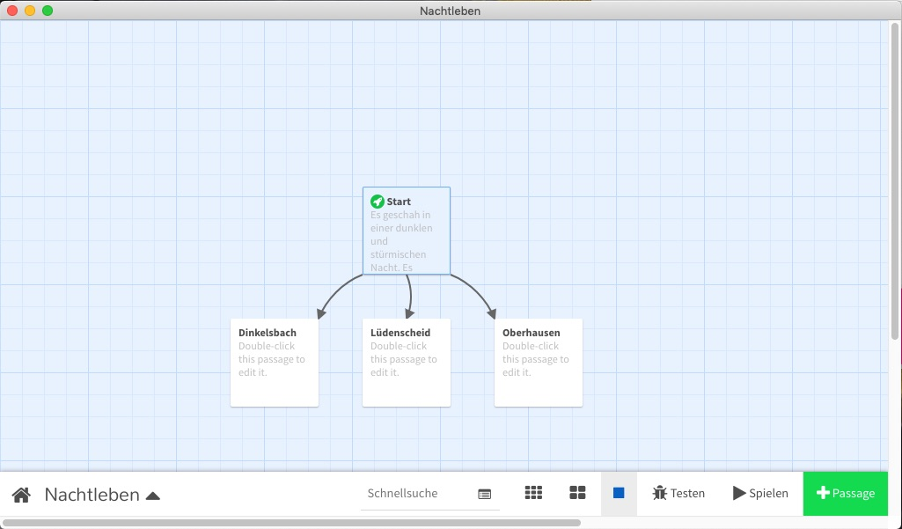
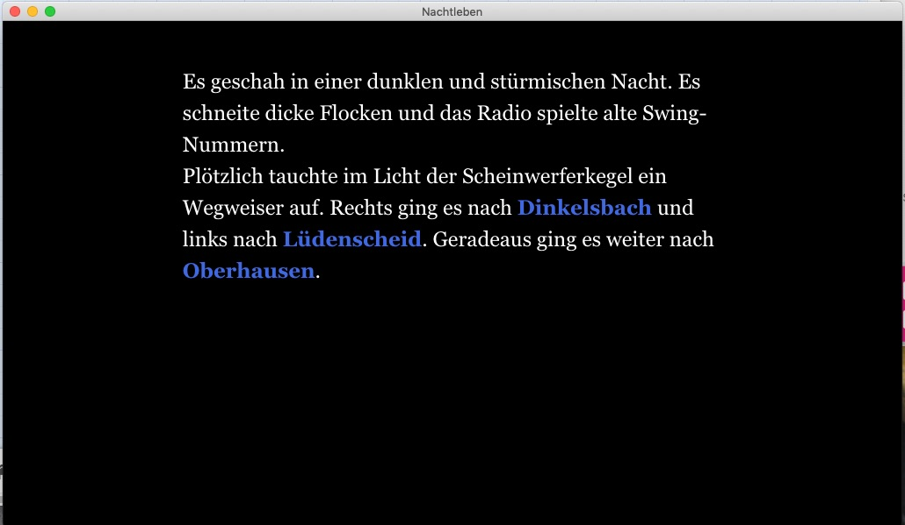
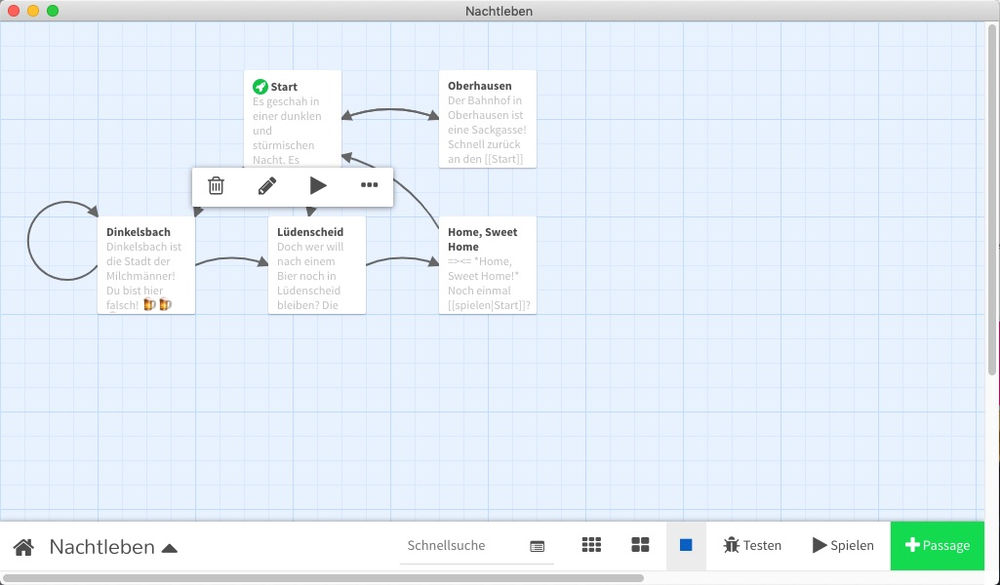

## Tutorial: Erste Schritte mit Twine

[Twine 2](http://cognitiones.kantel-chaos-team.de/multimedia/spieleprogrammierung/twine2.html) ist ein Open Source (GPL) Programm (Linux, MacOS X, Windows), um nichtlineare, interaktive Geschichten (Interactive Fiction (IF)) wie Text-Adventures im Browser zu erzählen. Das Tool schreibt statische Seiten nach HTML5 heraus, so daß serverseitig keinerlei Ansprüche bestehen.

<<<<<<< Local Changes
Twine ist entwickelt worden, um Menschen ohne Programierkenntnisse das Erstellen von Hypertext-Geschichten zu ermöglichen. In dieser Hinsicht ähnelt es ein wenig dem verflossenen [HyperCard](http://cognitiones.kantel-chaos-team.de/programmierung/hypercard.html), auch das (Default-) Story-Format [Harlowe](https://twine2.neocities.org/) erinnert von seiner Syntax ein wenig an HyperTalk.
=======
Twine ist entwickelt worden, um Menschen ohne Programierkenntnisse das Erstellen von Hypertext-Geschichten zu ermöglichen. In dieser Hinsicht ähnelt es ein wenig dem verflossenen [HyperCard](http://cognitiones.kantel-chaos-team.de/programmierung/hypercard.html), auch das (Default-) Story-Format [Harlowe](https://twine2.neocities.org/) erinnert von seiner Syntax ein wenig an HyperTalk.

In diesem Tutorial möchte ich zeigen, wie man mit wenigen Befehlen eine interaktive Geschichte in Twine schreiben kann. Ich kratze dabei auch nur an die Oberfläche von Harlowe, die eine sehr mächtige Programmiersprache sein kann.

Twine kann als [Webapp](http://twinery.org/2/#!/stories) genutzt werden. Da ich mich aber [bekanntlich mit Onlinbe-Editoren nicht anfreunden kann](http://blog.schockwellenreiter.de/2019/08/2019081901.html), verwende ich die downloadbare Desktop-Version -- eine [Electron](http://cognitiones.kantel-chaos-team.de/webworking/frameworks/electron.html)-App. Die Bedienung der beiden Versionen ist nahezu identisch. Das Tutorial verwendet Twine 2.3.1 und Harlowe 3.0.2.

Wenn Twine gestartet wird, erscheint zuerst ein Bildschirm, der die bisher mit Twine erstellten Geschichten anzeigt oder noch leer ist. Mit einem Klick auf den grünen rechten Button wird eine neue Geschichte erzeugt. Ich nenne sie »Nachtleben« (der Name einer Twine-Story kann jederzeit geändert werden).

<<<<<<< Local Changes
>>>>>>> External Changes
=======
Es öffent sich der Editor, er sieht so aus:

Wenn Ihr mit der Maus über das Kästchen in der Mitte fahrt (im Twine-Jargon »Passage« genannt), könnt Ihr auf einen Stift klicken und die Passage editieren. Gebt einfach folgenden Text (mit den doppelten eckigen Klammern!) dort ein:

~~~
Es geschah in einer dunklen und stürmischen Nacht. Es schneite dicke Flocken
und das Radio spielte alte Swing-Nummern.

Plötzlich tauchte im Licht der Scheinwerferkegel ein Wegweiser auf.
Rechts ging es nach [[Dinkelsbach]] und links nach [[Lüdenscheid]]. Geradeaus
ging es weiter nach [[Oberhausen]].
~~~

Außerdem könnt Ihr oben, wo noch »Unbenannter Absatz« steht, eine Überschrift für Eure Passage eingeben. Ich habe sie einfach start genannt.

Wenn Ihr nun wieder zurück in die Editor-Ansicht wechselt, sieht er nun so aus:

Die doppelten eckigen Klammern sind nämlich Links zu neuen Passagen und Twine hat diese für mich angelegt. Mit einem Klikc auf den Knopf `Spielen`rechts unten können wir das Spiel sogar spielen. Dabei erhalten wir folgenden Bildschirm:

Ich mag den Dark-Mode (also weiße Schrift auf schwarzem Grund) nicht. Er beleidigt meine alten Augen und ist außerdem im Sonnenlicht kaum lesbar. Daher werde ich erst einmal dieses ändern.

Im Editor links unten gibt es ein Aufklappmenü mit dem Namen des Spiels. Klikct Ihr dieses an, könnt Ihr unter anderem `Stylesheet der Geschichte bearbeiten`auswählen. Dort gebe ich bei jeder Geschichte folgenden CSS-Code ein:

~~~css
tw-story {
  background-color: #ffffff;
  color: #000000;
}

tw-sidebar tw-icon.redo {
	display: none;
}
tw-sidebar tw-icon.undo {
	display: none;
}

tw-passage {
	text-align: left; 
	font-size: 4vh;
	font-size: 4vw;
	font-size: 4vmin;
	line-height: normal;
}

img {max-width: 100%;
     max-height: 100%;
}
~~~

Die Zeilen mit dem `tw-icon.redo` und `tw-icon.undo` scheinen seit Harlowe 3.0.1 obsolet zu sein. Bis dahin hatten sie zwei (Default-) »Mogelbuttons« versteckt. Aber da sie niemand wollte, sind sie im letzten Release verschwunden. Auch ich weine ihnen keine Tränen nach -- sicherheitshalber lasse ich sei aber noch stehen (falls sie doch wieder eingebaut werden, bin ich gewappnet).

Der erste Eintrag setzt die Hintergrundfarbe der Geschichte auf weiß und die Textfarbe auf schwarz. Und die beiden letzten Einträge sorgen für responsives Verhalten bei Bildern und Texten (zu den Bildern komme ich später noch.

Füllen wir einfach die drei neuen Passagen mit Text. Zuerst die Passage `Dinkelsbach`:

~~~
Dinkelsbach ist die Stadt der Milchmänner! Du bist hier falsch!
🍺🍺🍺 Gutes Bier gibt es nur in [[Lüdenscheid]].
Aber auf gar keinen Fall in [[Dinkelsbach]], hier gibt es nur Milch.
~~~

Selbstverständlich kann Twine mit Emojis umgehen. Zum Beweis habe ich die drei Biergläser dort eingebaut. 🤓 Doch nun zur Passage `Lüdenscheid`:

~~~
Doch wer will nach einem Bier noch in Lüdenscheid bleiben? Die Frau an Deiner Seite erinnert Dich an Dein kuscheliges Bett. Also ab nach [[Hause -> Home, Sweet Home]]!
~~~

Der Link mit dem Pfeil (`->`) ist eine alternative Form, in der Harlowe mit Links umgehen kann. Der Linktext `Hause` verlinkt auf die Passage `Home, Sweet Home`. Es gibt noch weitere, alternative Linkformen, unter anderem kann man den Pfeil `->` durch einen senkrechten Strich `|` ersetzen, aber die mit dem Pfeil scheint in Harlowe seit Version 2.0 die empfohlene Form zu sein.

Zu guter Letzt kümmere ich mich um die Passage `Oberhausen`:

~~~
Der Bahnhof in Oberhausen ist eine Sackgasse!
Schnell zurück an den [[Start]]
~~~

Nun ist das schon fast eine kleine Geschichte. Nur die neugeschaffene Passage `Home, Sweet Home` braucht noch ein wenig Text:

~~~
=><=
*Home, Sweet Home!*

Noch einmal [[spielen -> Start]]?
~~~

Die beiden nach innen zeigenden Doppelpfeile (`=><=`) weisen Twine an, den folgenden Text zu zentrieren und die Sternchen sind wie in Markdown der Befehl, den eingeschlossenen Text *kursiv* zu setzen.

Schaut nun auf den Editor in seiner neuen Schönheit. Die Passagen wurden von Twine eigenständig erzeugt, ich habe sie nur per *Drag and Drop* ein wenig zurechtgerückt:

Aber was ist mit Bildern? Bilder können in Twine mit ganz normalen HTML-Befehlen eingebunden werden. So hat zum Beispield die Startpassage vor jedem Text diese Zeile:

~~~html

~~~

Und da seht Ihr schon das Crux an der Sache. Damit Twine die Bilder findet, müssen sie auf einem Server liegen. Bei mir läuft sowieso ununterbrochen ein [MAMP](http://cognitiones.kantel-chaos-team.de/webworking/mamp.html), der auf Port 8888 lauscht. Da Hotlinking auf gar keinen Fall geht, habe ich dort in der `htdocs` ein Verzeichnis `twine`mit einem Unterverzeichnis `images` angelegt und dort kommen alle Bilder hinein. Wenn ich nun die Geschichte veröffentliche, tausche ihc durch ein globales *Suchen und Ersetzen* (das ist das kleine Viereck unten in der Mitte) mein lokales Bilderverzeichnis durch das endgültige Verzeichnis aus, auf dem die Bilder auf dem Server liegen. Das kann eine absolute URL, aber auch ein relatives Verzeichis sein, das endgültige Ergebnis einer Twine Geschichte ist HTML5 mit JavaScript, das nimmt da nichts krumm.

Okay, in diesem Fall habe ich jede Passage noch mit einem Bild versehen -- ich bin ein visueller Mensch und brauche Bilder. Wenn Ihr die Geschichte nachbauen wollt, Ihr findet sie alle in meinem [GitHub-Repositorium zu Twine](https://github.com/kantel/twine-entdecken).

Zum Schluß muß die Geschichte nur noch veröffentlicht werden. Das Aufklappmenü links unten hat einen Unterpunkt `Als Datei veröffentlichen` und dieser schreibt die HTML-Datei heraus. Jetzt müßt Ihr diese Datei (und die Bilder) »nur« noch auf einen Server Eurer Wahl legen und der staunenden Weltöffentlichkeit präsentieren.

Bei mir liegt sie hier: [Twine entdecken](http://blog.schockwellenreiter.de/gems/twine-entdecken/) und sie ist auch recht gut auf meinem Smartphone zu lesen. Der erste Screenshot oben zeigt, wie sie aussieht.

Natürlich kratzt dieses Tutorial nur an der Oberfläche von dem, was mit Twine und Harlowe alles möglich ist. Neben dem [Online-Wiki](http://twinery.org/wiki/) ist das Buch »[Writing Interactive Fiction with Twine][a1]» von *Melissa Ford* eine inspirative Quelle. Die gedruckte Version ist vergriffen und gebraucht momentan nur zu Mondpreisen erhältlich, aber die [Kindle-Version][a2] gibt es zu einem vernünftigen Preis (9,16&nbsp;€).

[a1]: https://www.amazon.de/Writing-Interactive-Fiction-Twine-Melissa/dp/0789756641/ref=as_li_ss_tl?_encoding=UTF8&qid=1566754634&sr=8-1&linkCode=ll1&tag=derschockwell-21&linkId=e6107a4df5fa296f4b08423aa12a34f0&language=de_DE

[a2]: https://www.amazon.de/Writing-Interactive-Fiction-Twine-English-ebook/dp/B01ERR2TN2/ref=as_li_ss_tl?_encoding=UTF8&qid=1566754634&sr=8-1&linkCode=ll1&tag=derschockwell-21&linkId=d5dd114a5f74fe977caa48eb1a07c46d&language=de_DE

Uch mich juckt es in den Fingern, nicht nur weitere Tutorials zu Twine, sondern vielleicht sogar richtige Geschichten und/oder Spiele mit Twine zu veröffentlichen. Schaun wir mal, was die Zukunft bringt. *Still digging!*>>>>>>> External Changes
